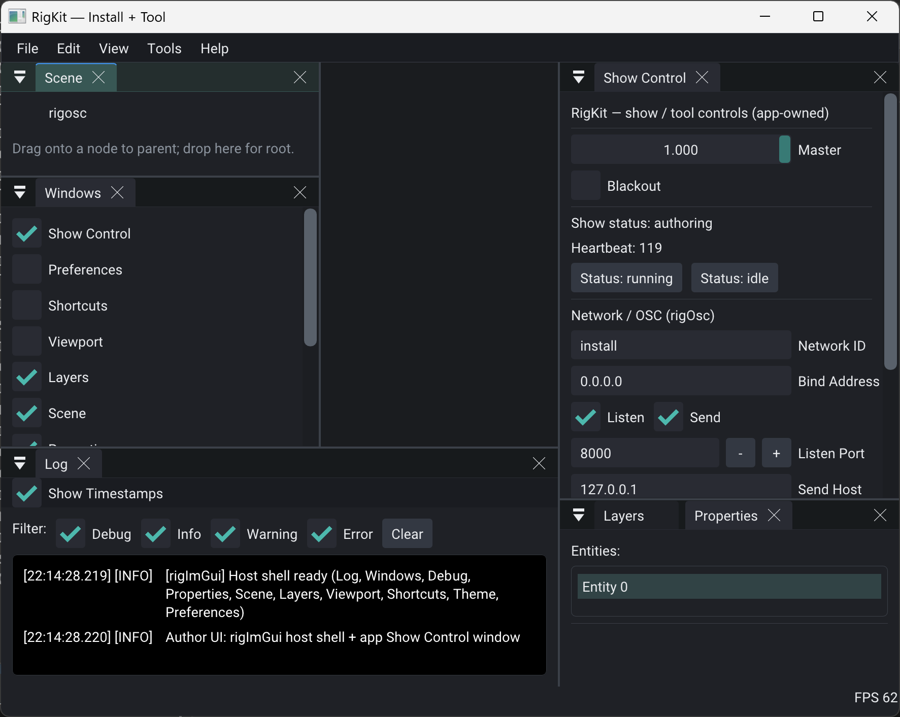
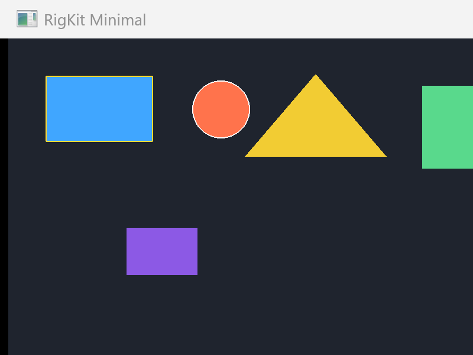

# RigWorks



**A no-code creative application framework.**  
*Because no code is the best code.*

RigWorks — **Rig** for short, and Rig in all running text — is a shared data vocabulary for creative applications. It is a framework you never install — no library to link, no runtime to embed, no API to version. It ships as agreement: two loop rules and a shared vocabulary. Apps that speak the same schema ids share fields and units, so their content interoperates without either app knowing the other exists.

**Concept is more important than execution.** What a transform *is* outlives every renderer that ever drew one. Rig keeps the concept and leaves the execution to you — [why no code](docs/why-no-code.md).

**AI co-coding is here to stay.** When execution gets cheap, the shared concept becomes the scarce asset. Rig publishes it in a form people and models read the same way — [AI collaboration](docs/ai-collaboration.md).

## The framework

1. **Rules** — [SUDE](docs/sude.md) (Setup / Update / Draw / Exit) and [ECS](docs/ecs.md). Enough to **be Rig**.
2. **Schemas** — agreed POD field layouts ([prose](schemas/) + [JSON Schema](schemas/json/)). Ship what you support.
3. **Properties** — portable [datatype](docs/properties.md) rows.
4. **Optional UI** — [Rig + UI](docs/ui.md) editing the same data.

Words used precisely — Contract, fulfillment, host, pack: [docs/terms.md](docs/terms.md).

Wire format is **JSON** ([`rig.document`](schemas/document.md)). Validate generated output:

```bash
npm run setup                                          # once — installs the validator
node tools/rig-validate/cli.js examples/minimal-scene.json
npm run check                                          # schemas, parity, links, goldens
```

## Worked example

Hosts run a SUDE loop; portable content is ECS components on entities:

```text
Setup  → spawn / load entities
Update → simulate (modulators, transport, …)
Draw   → present
Exit   → tear down
```

One entity in Contract JSON ([`examples/minimal-scene.json`](examples/minimal-scene.json)):

<!-- rig:begin entity=demo-rect from=examples/minimal-scene.json -->
```json
{
  "id": "demo-rect",
  "components": {
    "rig.meta.named": {
      "name": "demo-rect",
      "stableId": "demo-rect"
    },
    "rig.spatial.transform": {
      "position": [
        64,
        64,
        0
      ],
      "rotation": [
        0,
        0,
        0,
        1
      ],
      "scale": [
        1,
        1,
        1
      ]
    },
    "rig.geometry.shape": {
      "type": "rectangle",
      "x1": 0,
      "y1": 0,
      "x2": 180,
      "y2": 110,
      "sides": 5,
      "innerRadius": 0.5
    },
    "rig.paint.fill_stroke": {
      "fillRgba": [
        0.25,
        0.65,
        1,
        1
      ],
      "strokeRgba": [
        0,
        0,
        0,
        1
      ],
      "strokeWidth": 1,
      "hasFill": true,
      "hasStroke": false
    },
    "rig.interact.selectable": {
      "enabled": true
    }
  }
}
```
<!-- rig:end -->

More patterns: [`examples/`](examples/). Interchange notes (including RigKit `.rig` key aliases): [`docs/interchange.md`](docs/interchange.md).

## For AI agents

Load the condensed skill before generating Rig data: [`skills/generating-rig-documents/SKILL.md`](skills/generating-rig-documents/SKILL.md). Cross-agent onboarding: [`AGENTS.md`](AGENTS.md). Discovery index: [`llms.txt`](llms.txt). Why the repo is shaped this way: [`docs/ai-collaboration.md`](docs/ai-collaboration.md).

Always validate emission:

```bash
node tools/rig-validate/cli.js path/to/doc.json
```

## Reference host

[RigKit](https://github.com/rigkid/rigkit) fulfills Rig on desktop (GLFW / OpenGL / packs). The family lives under the [rigkid](https://github.com/rigkid) org: **RigWorks** is the spec, **RigKit** is the reference host. RigKit's `minimal` demo presents the same scene shape family as `examples/minimal-scene.json`:



## Version

**0.4.0** — draft vocabulary

> See [docs/versioning.md](docs/versioning.md).

## More reading

| Start here | |
|------------|--|
| [docs/why-no-code.md](docs/why-no-code.md) | Why a framework with no code, and what it costs |
| [docs/terms.md](docs/terms.md) | Contract, fulfillment, host, pack, POD |
| [docs/honors.md](docs/honors.md) | The minimum bar — is it Rig? |

| The rules | |
|-----------|--|
| [docs/sude.md](docs/sude.md) | Setup / Update / Draw / Exit |
| [docs/ecs.md](docs/ecs.md) | Entity–component conventions |
| [docs/ui.md](docs/ui.md) | Optional UI layer over the same data |

| The data | |
|----------|--|
| [schemas/README.md](schemas/README.md) | Catalog of schema ids |
| [schemas/json/](schemas/json/) | Machine grammar |
| [schemas/document.md](schemas/document.md) | Document envelope |
| [docs/properties.md](docs/properties.md) | Portable datatypes |
| [docs/interchange.md](docs/interchange.md) | Wire format and host aliases |
| [examples/](examples/) | Golden documents |

| Working with models | |
|---------------------|--|
| [docs/ai-collaboration.md](docs/ai-collaboration.md) | Why concepts beat prompts |
| [skills/generating-rig-documents/SKILL.md](skills/generating-rig-documents/SKILL.md) | The skill to load before generating |
| [tools/](tools/) | Validator, parity, and link checks |

## License

MIT — [LICENSE](LICENSE).
