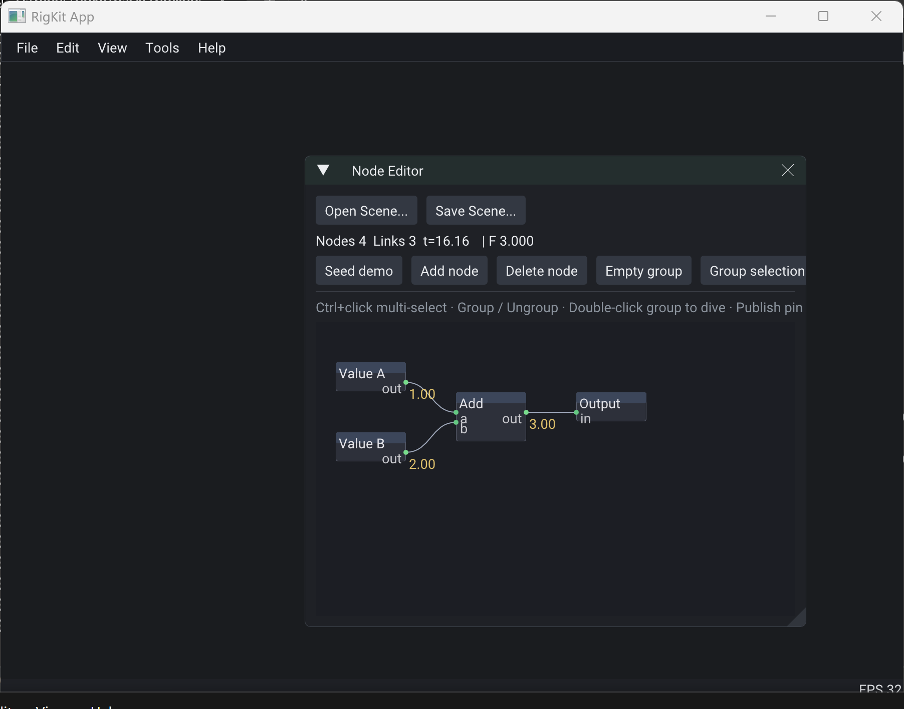

# `rig.node.graph`

Portable node graph on one entity. Format when present.

Also used **inline** as `nested` on a [`rig.node.node`](node.md) for nestable groups.

| Field | Type | Meaning |
|-------|------|---------|
| `nodes` | node[] | Graph nodes — see [`rig.node.node`](node.md) |
| `links` | link[] | Directed pin links — see [`rig.node.link`](link.md) |
| `nextId` | uint | Next id allocator for nodes / links / pins |

## Contract vs host

| Layer | Owned by | Examples |
|-------|----------|----------|
| Portable PODs | Rig | graph / node / pin / link / param / publish fields |
| Value `type` ids | Rig [properties](../../docs/properties.md) | `float`, `vec2`, `vec4`, … |
| Catalog `typeId`s | Host / pack | `float.add`, `mod.lfo`, `color.value`, `group` |
| Evaluation | Host / pack | Graph walk, group recursion, coercion, outputs |

## Nestable groups

A node with `nested` is a group: it appears as one node on the parent canvas; its interior is another graph. Published pins ([`rig.node.publish`](publish.md)) expose selected interior pins as the group's outer interface. Recursion is allowed.

Editor mirrors (`nodeCount`, …) and dive UI state are host-only — do not serialize.

## Fulfillment

[RigKit](https://github.com/rigkid/RigKit)'s node editor over the same PODs — two value nodes into an add node, one link per pin pair. Canvas positions, live pin readouts, and selection are host state; only the fields above travel.

